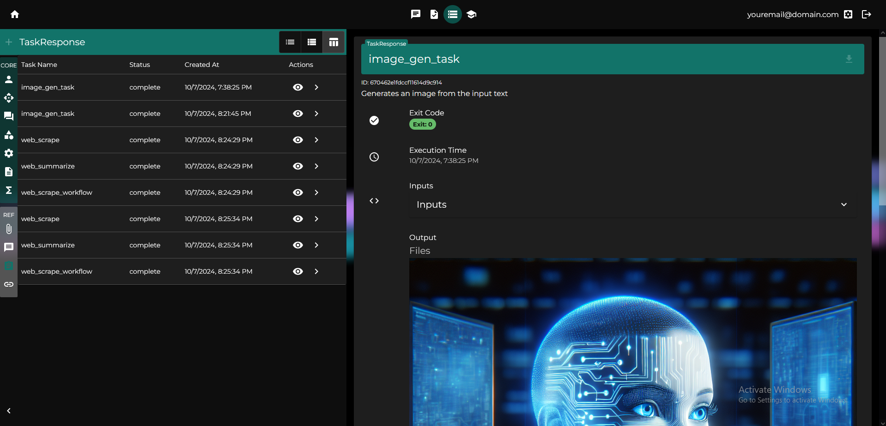
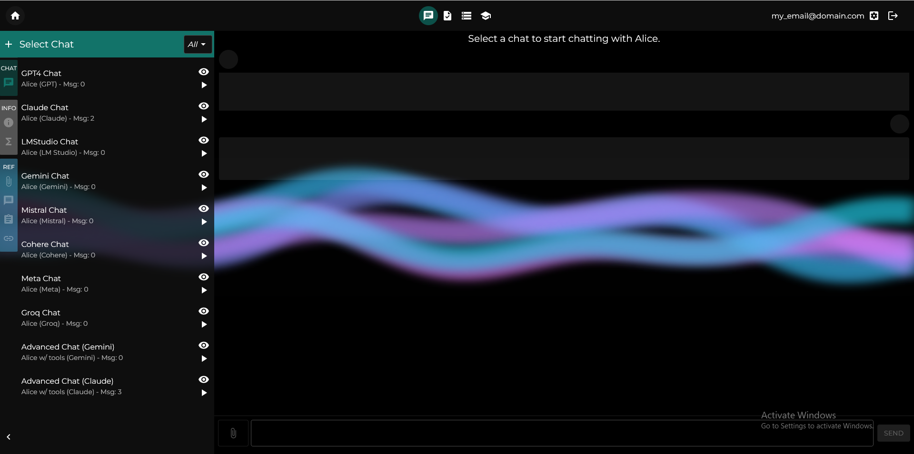
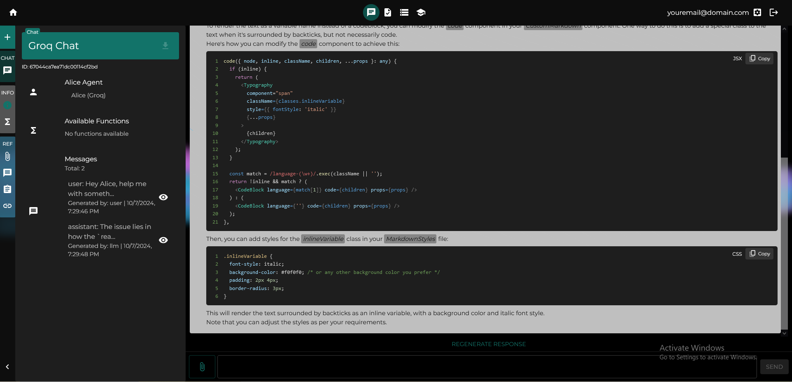
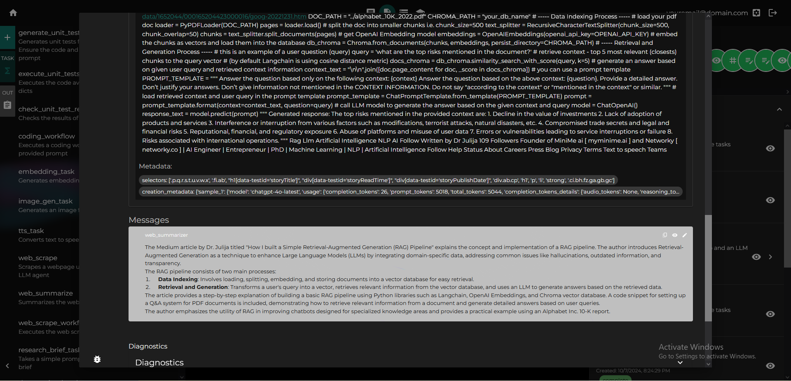

# Alice: Advanced Language Intelligence and Cognitive Engine


Alice is an agentic workflow framework that integrates task execution and intelligent chat capabilities. It provides a flexible environment for creating, managing, and deploying AI agents for various purposes, leveraging a microservices architecture with MongoDB for data persistence.

## Project Structure

The project consists of three main components:

1. Backend (Node.js with Express - TS)
2. Workflow (Python - Pydantic)
3. Frontend (React - TS)

## The Goal
1. Provide a tool to create, test and deploy agentic solutions
2. A `human-language` framework where text is the primary input and the output of most operations, with the goal of making this tool easy to engage with by both users and agents
3. Produce a model-agnostic/brand-agnostic framwork, allowing the user to set and deploy their solutions however they want
4. Offer an open-source option that helps put the control in the users hand 

## Setup and Installation

1. Ensure you have [Docker installed](https://docs.docker.com/engine/install/) on your system. On Windows, once you do, it comes with the docker-compose plugin installed by default, but [check if you have it installed](https://stackoverflow.com/questions/72928891/how-can-i-check-if-docker-compose-plugin-is-installed). Otherwise (if in Linux for example), [install it](https://docs.docker.com/compose/install/linux/). If for whatever reason the starting script doesn't start Docker (can't find it), all you need to do is open your Docker app. 

2. (Optional) Install LM Studio if you plan to use local models.

3. Download the repository:
   ```
   git clone https://github.com/MarianoMolina/project_alice.git
   ```

4. Create a `.env` file in the root directory using the `template.env` file as a reference. Complete the data for any APIs you want to use (e.g., OpenAI API key). Even if you don't update anything, if you don't create it / copy it, the build process will fail. 

5. Run the appropriate script for your operating system:
   - Windows: Run `run.bat`
   - Linux/Mac: Run `run.sh`
Alternatively you can just execute run.py using `python run.py` in a commandline while in the repository folder

This will build and launch the containers. Once ready, the frontend will be accessible at `http://localhost:4000/`. 

If you see an error during the installation related to `403  connecting to archive.ubuntu.com`, just run it again. Sometimes Docker has an issue installing an image due to connection errors. 

**NOTE**: If you want to update, run `python update.py`

## Framework


The framework is based around 4 main components:
- APIs and their engine
- Agents, which deploy prompts and have models for any API they want to use
- Tasks that leverage agents, other tasks and APIs to produce an output
- Chats, that leverage tasks and agents, to produce a conversational experience

These components share information in one of 4 main ways, all of which have a string representation:
- Files (All file types have a method for generating a 'transcript' for the file, and files generated through prompts keep it as a representation)
- Messages
- Task Results
- URL References

## Features

### 1. Task Execution
- Create and execute custom tasks using predefined classes or by creating new ones in the Workflow module
- Define new parameters, prompts/templates, and agents for task deployment
- Execute tasks with custom parameters
- Run tasks directly from the frontend, or programatically with the workflow container's API
- Supported task types include:
  - Workflow -> Combine other tasks
  - API tasks: Reddit, Wikipedia, Google, Exa, and Arxiv search -> Retrieve information
  - Agentic tasks:
    - Prompt Agent Tasks: Including the base PromptAgentTask, and CheckTask, CodeExecutionLLMTask and CodeGenerationLLMTask
    - Agent Tasks: WebScrapeBeautifulSoupTask, TextToSpeechTask, GenerateImageTask, and EmbeddingTask

### 2. Intelligent Chat
- Create and manage chat conversations with AI agents
- Add references from other conversations or task executions to enrich the chat context
- Integrate new tasks as tools for the active agent during chat
- Support for various message types (text, image, video, audio, file) -> automatic transcript is created so the agent can interpret
- Deploy these agents wherever you want, since the workflow API offers an endpoint to create chat completions

### 3. Extensible Framework
- Modular architecture allowing easy addition of new components
- Flexible integration of external APIs and models
- Support for multiple AI models, including local and remote deployments

### 4. User Management
- User authentication and authorization
- Role-based access control (user and admin roles)

### 5. Flexible Model Deployment
- Deploy local models using LM Studio
- Use any OpenAI-compatible endpoints (Groq, Mistral & Llama) or Anthropic, Gemini, and Cohere models to power your agents and workflows

### 6. Programatic Access to your Tasks and Chats
- The Workflow container exposes its API to your `http://localhost:8000/`, with routes `/execute_task` and `/chat_response/{chat_id}` as the primary entry points. You'll need the token for validation. 
-  Check the relevant routes files for the prop structure. 

## Usage

The Alice framework provides a user-friendly frontend interface for interacting with the system. Through this interface, you can:

1. Create and manage AI agents, models, prompts, parameters, tasks, api, etc. in your personal database

View all the references you've created, like files, messages, task responses, etc:

2. Start and manage chat conversations

Select a chat or create a new one, and start interacting with your agents. 

3. Create and execute various types of tasks

View their outputs, run them again, change their settings, etc.

4. Manage your user account and api config. 


### Types of Tasks

- `API tasks`: Tasks that use non-model APIs. Examples include the Google, Wikipidia, Arxiv, Exa and Reddit search tasks. 
- `Prompt agent tasks`: Tasks that use prompts and agents. Base functionality is generating an LLM response to a prompt. This task has some 'child' tasks:
  - `CheckTask`: Task structured to compare the output generated by the agent with the strings in exit_code_response_map. Allows for easy ways to classify things. For example "Respond with WRONG if the answer is flawed, and CORRECT if the answer makes sense" could be used as a gate to know what task to deploy next. 
  - `CodeExecutionLLMTask`: Task takes the input message, retrieves all code blocks and executes them in a docker container
  - `CodeGenerationLLMTask`: Task that ensure the output generated contains at least one codeblock, or fails. 
- Other agent tasks: Sibling task classes to the prompt agent task, that don't use a prompt to template the task. 
  - `Text-to-speech task`: In this case, it uses the agent to determine which model to use for the generation, and returns a file with the speech created. 
  - `WebScrapeBeautifulSoupTask`: Takes a URL, retrieves it, task a string sample of the html to show an agent who creates the selectors for BeautifulSoup parsing of the content. 
  - `GenerateImageTask`: Takes an image prompt and uses the agent's img_gen model to generate an image based on it. 
  - `EmbeddingTask`: Takes a string and the agent's embeddings model to generate the vector embeddings for the text provided. 
- `Workflow`: The simplest a most complex task. Simple because all it does is run other tasks. Complex because the options are endless. Main difference is they have a tasks_end_code_routing to map the logic path and require a start_task to begin it. 

### Available APIs
```typescript
export enum ApiName {
    OPENAI = 'openai_llm',
    OPENAI_VISION = 'openai_vision',
    OPENAI_IMG_GENERATION = 'openai_img_gen',
    OPENAI_EMBEDDINGS = 'openai_embeddings',
    OPENAI_TTS = 'openai_tts',
    OPENAI_STT = 'openai_stt',
    OPENAI_ASTT = 'openai_adv_stt',
    AZURE = 'azure',
    GEMINI = 'gemini_llm',
    GEMINI_VISION = 'gemini_vision',
    MISTRAL = 'mistral_llm',
    MISTRAL_VISION = 'mistral_vision',
    MISTRAL_EMBEDDINGS = 'mistral_embeddings',
    GEMINI_STT = 'gemini_stt',
    GEMINI_EMBEDDINGS = 'gemini_embeddings',
    COHERE = 'cohere_llm',
    GROQ = 'groq_llm',
    GROQ_VISION = 'groq_vision',
    GROQ_TTS = 'groq_tts',
    META = 'meta_llm',
    META_VISION = 'meta_vision',
    ANTHROPIC = 'anthropic_llm',
    ANTHROPIC_VISION = 'anthropic_vision',
    LM_STUDIO = 'lm-studio_llm',
    LM_STUDIO_VISION = 'lm-studio_vision',
    CUSTOM = 'Custom',
    // Non-model API providers
    GOOGLE_SEARCH = 'google_search',
    REDDIT_SEARCH = 'reddit_search',
    WIKIPEDIA_SEARCH = 'wikipedia_search',
    EXA_SEARCH = 'exa_search',
    ARXIV_SEARCH = 'arxiv_search',
}
```

## Development

### Adding New Task Types

1. Create a new task class in the Workflow module, extending the `AliceTask` base class.
2. Implement the `run` method to define the task's behavior.
3. Add the new task to the `available_task_types` list in `workflow/core/tasks/__init__.py`.
4. Add the new task type to the `TaskType` enum in the `backend/interfaces/task.model.ts` and `frontend/src/types/TaskTypes` files.

### Adding New API Types and API Names

1. Update the `ApiType` and `ApiName` enums in the backend, frontend and workflow containers.
2. Implement the necessary logic in the workflow container to handle the new API type.
3. Update the frontend to support the new API type in the API management interface.

For detailed instructions on adding new API types and names, refer to the backend and workflow README files.

### Adding New Models, APIs, Tasks, Chats, Agents

To add new instances: 

1. Navigate to the Database page in the frontend and select the entity type you want to create and click on create new.
2. To add new entities that will be available to new users (or to yourself if you decide to re-initialize your DB), you can modify the workflow initialization modules:
   - Locate the `workflow/db_app/initialization/modules` directory in the workflow container.
   - Create a new module file or modify existing ones to include your new entities.
   - Update the `module_list` list in `workflow/db_app/initialization/modules/__init__.py` to include your new module.

For more detailed information on creating and managing initialization modules, refer to the workflow container README.

## Contributing

Contributions are welcome! Please follow these steps:

1. Fork the repository
2. Create a new branch: `git checkout -b feature-branch-name`
3. Make your changes and commit them: `git commit -m 'Add some feature'`
4. Push to the branch: `git push origin feature-branch-name`
5. Submit a pull request

If you've created new tasks, workflows, or initialization modules that you'd like to share, please include them in your pull request along with appropriate documentation. We're particularly interested in contributions that expand the capabilities of the workflow initialization process, allowing users to start with a richer set of pre-configured entities.

## Future Features / Upgrades

1. **Workflow generator** [Done]: Improve the interface for workflow generation. Ideally, something that allows the user to handle tasks/nodes, visualize the execution of it, etc. 
   - [Added]: Flowchart for workflows
   - [Added]: Basic route end code editor

2. **More API engines and base tasks** [Done]: BeautifulSoup to scrap websites, vision_models, text_to_image_models, text_to_speech_models, etc. This will enable a new set of tasks to be created. This includes adding more providers, like Google, Mistral, etc. 
   - [Added]: 21 new API providers, with their corresponding models, for a total of 160 distinct entities for you to use. 
   - [Added]: 2 new workflows -> Web Scrape and Research. 

3. **File input and type interface** [Done]: Being able to add files of any type to a conversation, which makes a conversion to text of the file (stt, itt, or simply parsing for files that can be converted to a string), allowing for the user and the agents to share any type of data. This, in turn, requires the agents to also be able to produce different types of outputs, which is where the type interface logic comes in, to convert str -> any and back. 
   - [Added]: Image and Sound file support
   - [Added]: Both generation (TTS and Image Generation) as well as transcription (STT and Image Vision) available

4. **Complex Agent Structures**: Implementation of more advanced agent architectures, such as ReAct and RAG agents, to enable more sophisticated reasoning and decision-making capabilities.

5. **Work Environments / Data Clusters**: Introduction of a feature similar to Anthropic's Artifacts but easier to update, edit, modularize, etc., providing a more structured way to manage and interact with complex data and tools within the Alice ecosystem. Idea is to use a mix of in-context and RAG-powered sources, that the user is actively able to update, trim, etc. to ensure the correct info is available at the right time. 

6. **Journals**: Development of a holistic view of conversations and interactions, enabling the creation of workflows that run periodically. This feature will support tasks such as:
   - Reviewing and summarizing emails
   - Tracking and updating calendar events
   - Monitoring and responding to messages across various platforms
   - Reviewing and updating goal statuses
   - Generating periodic reports and insights
   - Updating RAG-sources

7. **Improvements and fixes**: There are several misc areas I think are crucial in the mid-term to tackle:
   - Edge-case analysis
   - Lazy-loading on the frontend
   - Context management -> be able to predict the context size of a chat or task instance, prevent extreme cases, etc. 
   - [Improved] Improve error handling and logging
      - [Added]: Logging folder, and better logs from all containers
      - [Added]: Logging managers with levels, allowing for dev and prod setups

8. **Unify the type files**: Create a single source of truth for types, enums, etc. Either in TS or Python, and the conversion logic to the other.  

9. **Make modular addition easy**: [Improved] Ideally, you should be able to sign up to a repository that has a workflow for example, and then be able to 'spawn' it in your current DB. Requires:
   - Module manager -> Select which modules you want to download and/or keep
   - Module integrator -> Select a module to create a fresh version in your DB -> What about removal? Would we want to add a variable to entities to keep track of this? 

10. **Cost management**: Currently, the completion metadata is stored, but not much is done with it. Goals are:
   - Good tracking of costs
   - Task cost estimation based on an algorithm and, when it exists, past data to improve the estimation. 
   - Cost/use tracking by API in a clear UI

## License

This source code is licensed under the BSD-style license found in the
LICENSE file in the root directory of this source tree. 

## Contact

For support or inquiries, please contact mampy3000@gmail.com